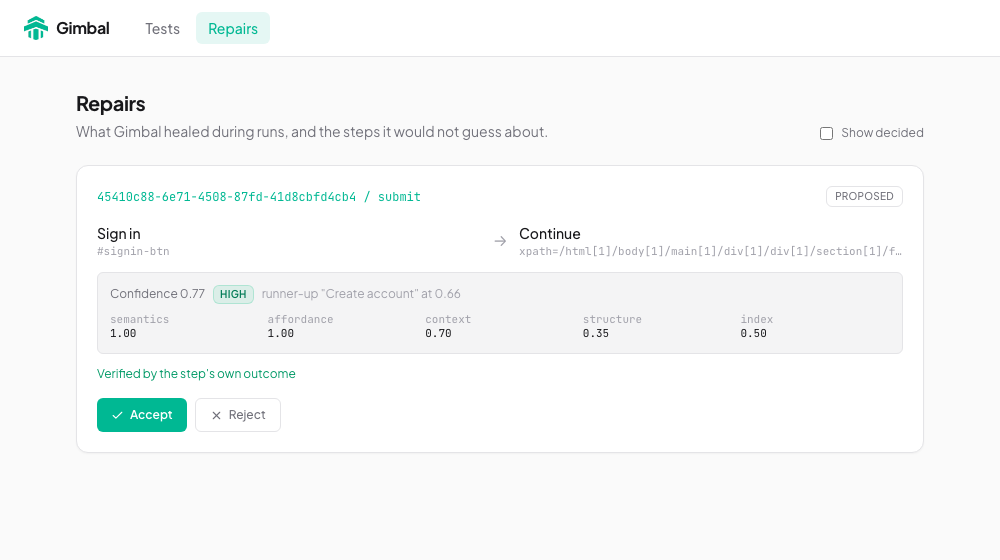

# Gimbal

Browser tests that survive UI changes, and tell you exactly what they changed.

You describe a test by meaning ("click the Sign in button"). Gimbal finds the element on your running app, stores it, and runs the test. When the page changes and the stored selector breaks, the run looks for the same element again, checks that acting on it did what the test expects, and records the change as a **repair** for you to accept or reject. When it cannot find anything it trusts, it says so instead of guessing.

No model is called at run time. Your coding agent writes the tests; Gimbal runs them.

> **Status: alpha.** Chromium only. The interfaces may change before 1.0.

## What it looks like

A login page changes its button from "Sign in" to "Continue", wraps the form in new containers and renames every class:

```
✓ grounded  Log in (3 steps)
✓ run passed

— the app changes —

✗ target not found: button "Sign in"
↻ re-resolving  semantics 1.00  context 0.70  structure 0.35
  chosen: button "Continue"  confidence 0.77 (high), runner-up "Create account" at 0.66
✓ outcome verified: the step's own assertion passed
⚑ repair proposed   gimbal repair show b78ac1a2
REVIEW  Log in
```



The Repairs page in the dashboard shows the before and after, the evidence and the verification, with **Accept** and **Reject**. Accepting writes the new selector into `grounded.json`, which you commit.

Run the whole story yourself, with no model anywhere: `pnpm demo:verify`.

## Quick start

You need Node 22 or newer and a web app you can run locally.

```bash
npx gimbal@alpha init
npx gimbal@alpha doctor --url http://localhost:3000
claude mcp add gimbal -- npx gimbal@alpha mcp      # or add the MCP server to your own agent
```

Then ask your agent: *"Create a Gimbal test that logs in and checks we land on the dashboard."* More in [Getting started](docs/getting-started.md).

```bash
npx gimbal@alpha test                  # exit 0 pass, 1 failed, 2 needs review
npx gimbal@alpha repair list           # what was healed or could not be
```

## How it works

```
Agent → intent (by role and name, never a selector)
      → Grounding: find the element on the live page, store it
      → Run: stored selector first
      → Healing: if it no longer matches, re-resolve that step only
      → Verification: did acting do what the step expects?
      → Repair: recorded in repairs.json, accepted or rejected by a person
```

Matching combines the element's accessible name and synonyms (a small embedding model that runs on your machine, pinned to an exact version), where it sits on the page, and its structure. Healing is stricter than first-time grounding: it needs a clear lead over the runner-up, label overlap with the target, and no identically named rival. Details in [How it works](docs/concepts/how-it-works.md).

## Evidence

On 22 target elements across seven small fixture apps, with seven kinds of change applied (154 cases), checked against the page itself:

| held-out apps (91 cases) | precision when acting | recovery rate |
|---|---|---|
| stored selector | n/a (never recovers) | 0% |
| `getByRole(name)` locator | 98% | 62% |
| Gimbal | 100% | 63% |

Be clear about what this says. For structural changes Gimbal and a plain role + name locator both do well; **Gimbal is not shown to recover more**. It refuses when an element was removed or is ambiguous, verifies a heal after acting, and keeps a reviewable record. It does not recover label changes you did not list as synonyms. The fixtures are small and the changes were chosen by the author. Method, per-mutation table and limits: [Evidence](docs/evidence.md).

## Limitations

- Chromium only. Single-page flows; no multi-tab or file-upload support yet.
- A heal can only be verified if the step has an outcome or assertion; otherwise it is recorded as unverified. Gimbal warns when a click has nothing checking it.
- Unlisted synonyms and other languages are not recovered. List synonyms in each target's `semantics`.
- The embedding model downloads once (about 25 MB) from Hugging Face.
- The local server has no authentication. It binds to localhost only; do not expose its port.

## Documentation

[Documentation index](docs/README.md) · [Architecture](docs/architecture.md) · [CLI](docs/reference/cli.md) · [MCP tools](docs/reference/mcp-tools.md) · [Configuration](docs/reference/configuration.md) · [Security](SECURITY.md) · [Changelog](CHANGELOG.md)

## Development

```bash
pnpm install
pnpm build && pnpm test && pnpm lint
pnpm demo:verify     # end-to-end story
pnpm bench:smoke     # healing benchmark, tuning apps
```

## Licence

Gimbal is source-available under the [Business Source License 1.1](LICENSE), not open source. The name Gimbal is not licensed. Contributions are not being accepted yet.
